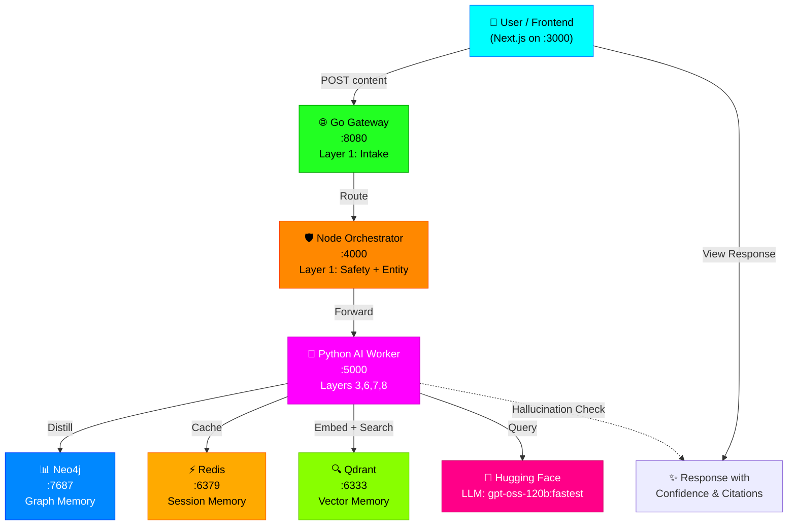
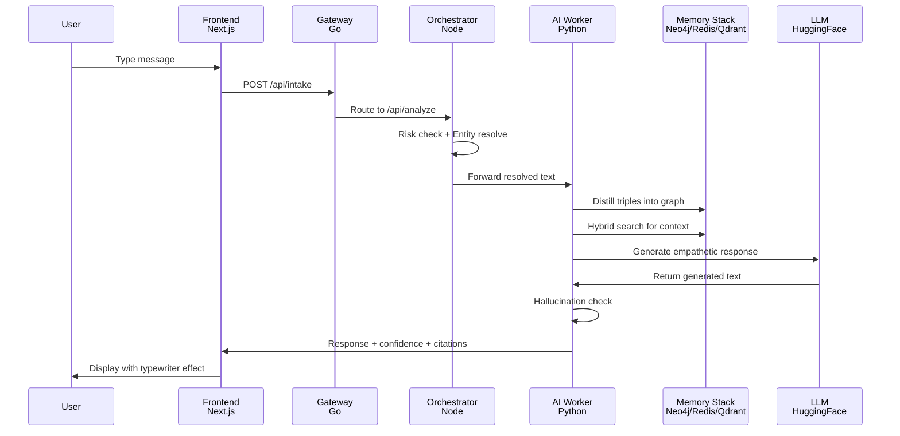
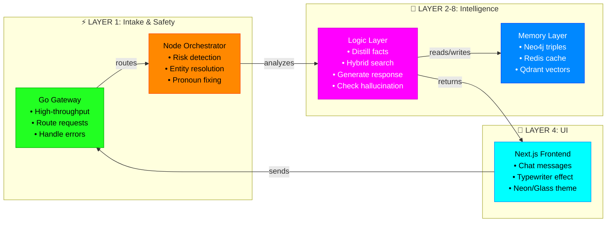

# OmniMind - Empathetic Mental Health AI

Track B competition submission.

OmniMind is a multi-service conversational system for mental-health support with:
- Go gateway for intake routing
- Node.js orchestrator for safety checks and entity resolution
- Python FastAPI worker for memory distillation, hybrid retrieval, and response generation
- Neo4j + Redis + Qdrant memory stack
- Next.js cyberpunk frontend (implemented and running)

## Current Status

- Full stack runs through `docker-compose`.
- Frontend is implemented in `frontend-nextjs` and exposed on port `3000`.
- API pipeline is active end-to-end: `gateway-go -> orchestrator-node -> ai-python`.
- Phase 8 hallucination checker is integrated in generation flow (`ai-python/app/core/hallucination.py`).

## High-Level Architecture

### Visual System Flow



### Text Flow

```text
Client / Frontend (Next.js)
        |
        v
Go Gateway (Layer 1 intake)
  POST /api/intake → Route to Orchestrator
        |
        v
Node Orchestrator (Layer 1 safety + entity resolution)
  POST /api/analyze → Safety checks + Entity resolution
        |
        v
Python AI Worker (Layers 3, 6, 7, 8)
  Memory Distill → Neo4j (store triples)
  Memory Retrieve → Hybrid search (Vector + BM25 + Graph)
  Generate → LLM + Hallucination Check + Citations
  Response → Back to Frontend
        |
    ┌───┼───┬────────┐
    v   v   v        v
  Neo4j Redis Qdrant HuggingFace
  Graph  Cache Vector  LLM
  DB     DB    DB
```

## Request → Response Pipeline



## Tech Stack

| Layer | Tech | Purpose |
|---|---|---|
| Gateway | Go 1.25 | High-throughput intake and routing |
| Orchestrator | Node.js + TypeScript + Express | Safety guardrails + entity resolution |
| AI Worker | Python 3.11 + FastAPI | Distillation, retrieval, response generation |
| LLM | Hugging Face Inference (`openai/gpt-oss-120b:fastest`) | Semantic extraction + empathetic response |
| Graph DB | Neo4j 5.26 | Episodic/semantic relationship storage |
| Cache/Memory | Redis 7 | Session memory + recent conversation |
| Vector DB | Qdrant | Dense retrieval for hybrid search |
| Frontend | Next.js 16 + React 19 + Tailwind 4 | Cyberpunk chat UI |
| Infra | Docker + Docker Compose | Containerized local deployment |

## What Each Layer Does



## Repository Layout

```text
omnimind/
|- docker-compose.yml
|- README.md
|- STARTUP_GUIDE.md
|- ai-python/
|  |- app/
|  |  |- api/routes.py
|  |  |- core/hallucination.py
|  |  |- db/clients.py
|  |  |- services/logic.py
|  |- scripts/ingest_corpus.py
|- gateway-go/
|  |- cmd/server/main.go
|- orchestrator-node/
|  |- src/index.ts
|- frontend-nextjs/
|  |- app/page.tsx
|  |- app/globals.css
|  |- Dockerfile
```

## Prerequisites

- Docker Desktop (running)
- Hugging Face token with inference access

Optional for local non-Docker development:
- Node.js
- Python 3.11
- Go

## Environment Setup

Create `.env` at the project root (or copy from `example.env`) and fill values:

```env
NEO4J_AUTH=neo4j/omnipassword123
REDIS_PORT=6379
NODE_PORT=4000
GATEWAY_PORT=8080
HF_TOKEN=hf_your_token_here
HF_MODEL_NAME=openai/gpt-oss-120b:fastest
MODEL_NAME=openai/gpt-oss-120b:fastest
QDRANT_URL=http://localhost:6333
```

Important:
- `NEO4J_AUTH` is required by the AI worker startup and must be in `username/password` format.
- Without valid `HF_TOKEN`, generation endpoints will not return model output.

## Run the Full Stack

```powershell
cd "g:\track b\omnimind"
docker-compose up -d --build
docker-compose ps
```

For a quick Docker-first frontend-only rebuild:

```powershell
docker-compose build frontend-nextjs
docker-compose up -d frontend-nextjs
```

## Service Endpoints

| Service | URL | Notes |
|---|---|---|
| Frontend (Next.js) | http://localhost:3000 | Cyberpunk chat UI |
| Go Gateway | http://localhost:8080 | `GET /health`, `POST /api/intake` |
| Node Orchestrator | http://localhost:4000 | `POST /api/analyze` (root returns 404) |
| Python AI Worker | http://localhost:5000 | Swagger at `/docs` |
| Neo4j Browser | http://localhost:7474 | default `neo4j / omnipassword123` |
| Qdrant | http://localhost:6333 | Vector DB API |
| Redis | localhost:6379 | Internal memory/cache |

## API Contracts (Code-Accurate)

### 1) Gateway: `POST /api/intake`

Request:

```json
{
  "user_id": "user_001",
  "session_id": "sess_001",
  "content": "I am feeling overwhelmed",
  "context": {}
}
```

Response (success):

```json
{
  "status": "success",
  "message": "Request safely routed to orchestrator",
  "user_id": "user_001",
  "routed": true,
  "metadata": {
    "orchestrator_url": "http://orchestrator-node:4000/api/analyze",
    "session_id": "sess_001",
    "timestamp": 1776459921
  }
}
```

### 2) Orchestrator: `POST /api/analyze`

Request:

```json
{
  "user_id": "user_001",
  "content": "I feel stressed and tired"
}
```

Behavior:
- Runs keyword-based risk checks (critical/high/moderate/low).
- Resolves references with simple pronoun/entity rewriting.
- For non-critical cases, forwards to AI worker `POST /api/generate` using `query`.

### 3) AI Worker Core Endpoints

`GET /`
- service metadata and endpoint index

`GET /health`
- client health for Neo4j, Redis, Qdrant, HF client, httpx

`POST /api/memory/distill`

```json
{
  "user_id": "user_001",
  "resolved_text": "I have trouble sleeping due to stress at work.",
  "context": {}
}
```

`POST /api/memory/retrieve`

```json
{
  "user_id": "user_001",
  "query": "work stress",
  "top_k": 5
}
```

`POST /api/knowledge/fetch`

```json
{
  "query": "breathing exercises for anxiety",
  "source": "reddit",
  "limit": 10
}
```

`POST /api/generate`

```json
{
  "user_id": "user_001",
  "session_id": "sess_001",
  "query": "I feel overwhelmed and anxious",
  "context": {},
  "tone": "empathetic",
  "include_citations": true
}
```

Notes:
- `query` is the active request field for generation.
- `POST /api/analyze` exists as an alias endpoint in AI worker and maps to distillation.

## Quick Smoke Tests

```powershell
# Gateway health
Invoke-RestMethod -Uri "http://localhost:8080/health" -Method GET

# AI worker health
Invoke-RestMethod -Uri "http://localhost:5000/health" -Method GET

# End-to-end through gateway
Invoke-RestMethod -Uri "http://localhost:8080/api/intake" -Method Post -ContentType "application/json" -Body '{"user_id":"demo_user","session_id":"sess_2","content":"I am nervous about tomorrow"}'
```

## Knowledge Base Ingestion

To populate Qdrant with fallback + scraped mental-health techniques:

```powershell
docker-compose exec ai-python python scripts/ingest_corpus.py
```

This script:
- Scrapes configured sources when available
- Falls back to bundled clinical techniques
- Embeds chunks with FastEmbed (`BAAI/bge-small-en-v1.5`)
- Upserts into Qdrant collection `knowledge_base`

## Frontend Notes

- Frontend lives in `frontend-nextjs` and is already integrated.
- UI is a custom cyberpunk console with:
  - typewriter response rendering
  - chat request forwarding to gateway
  - neon/glass styled interface
- Docker-first workflow means host `node_modules` and `.next` are not required for containerized run.

## Troubleshooting

- AI worker may return connection errors immediately after startup while Neo4j is still becoming ready. Retry after a few seconds.
- If AI worker exits during boot, verify `NEO4J_AUTH` format and value.
- If generation fails, verify `HF_TOKEN` in `.env` and token permissions.
- If frontend works but AI calls fail, inspect:
  - `docker-compose logs ai-python`
  - `docker-compose logs orchestrator-node`
  - `docker-compose logs gateway-go`

## Roadmap Snapshot

- [x] Layer 1 intake routing (Go)
- [x] Layer 1 safety/entity orchestration (Node)
- [x] Layer 2 memory infrastructure (Neo4j, Redis, Qdrant)
- [x] Layer 3 memory distillation and retrieval (FastAPI)
- [x] Layer 4 contextual generation with citations/confidence
- [x] Frontend implementation (Next.js cyberpunk UI)
- [x] Lightweight hallucination checking and response repair

## License

MIT. See `LICENSE`.
